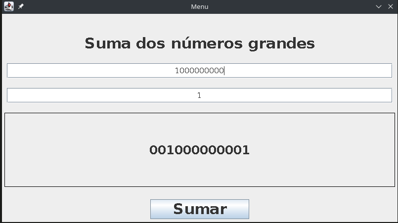

# Suma de números grandes

Programa que usa la implementación de listas doblemente enlazadas para la suma de números muy grandes. 

## Ejecución

En la raiz del proyecto se encuentra un script en bash que compila y ejecuta el programa `Program.sh`,
para ejecutarlo asegurese primero de que el archivo tiene permisos de ejecución en su sistema.

En caso de no tenerlos puede agregarlos con `chmod +x Program.sh`

y lo ejecuta de la siguiente forma `./Program.sh`

## Vistas

